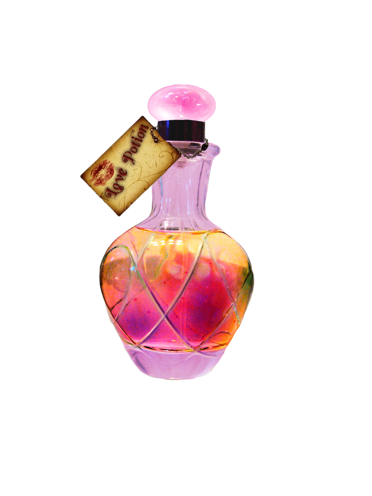

{fig-align="center"}

# 1. Introducción {#sec-1.-introducción}

------------------------------------------------------------------------

Bienvenido joven Muggle, ¡pareces muy curioso por venir aquí! Aquí os voy a hablar de mi universo favorito: Harry Potter.

*Un recordatorio rápido:* Harry Potter es una serie literaria de fantasía baja escrita por la autora británica J. K. Rowling, cuya secuela novelesca finalizó en 2007. La serie de siete novelas sigue las aventuras de un joven mago llamado Harry Potter y sus amigos Ron Weasley y Hermione Granger en el Colegio Hogwarts de Magia y Hechicería, dirigido por Albus Dumbledore. La trama principal de la serie implica la batalla de Harry contra Lord Voldemort, un mago oscuro que busca la inmortalidad y que una vez asesinó a los padres del chico. Al frente de sus fieles seguidores, los mortífagos, Voldemort lleva décadas buscando el poder absoluto sobre el mundo mágico y muggle (¡gracias wikipedia por este rápido resumen de la trama!).

Advertencia: ¡puede haber algunos spoilers! Pero no te preocupes, ¡Tengo el conjuro perfecto para que lo olvides todo!

**Venga,ahora sígame, ¡Espero que el viaje esté a la altura de sus expectativas!**

# 2. Los códigos y los datos {#sec-2.-los-códigos-y-los-datos}

------------------------------------------------------------------------

## Los datos y los códigos

```{r, echo = FALSE, message = FALSE}
#| code-fold: true
# Los Códigos
library(tidyr)
library(tidyverse)
library(ggplot2)
library(gganimate)
library(magick)
library(gt)
library(ggthemes)
library(readxl)
library(gapminder)
library(ggbump)
library(sf)
library(patchwork)
library(vembedr)
library(dplyr)
library(conflicted)

conflict_prefer("filter","dplyr")
conflict_prefer("mutate","dplyr")
conflict_prefer("rename","dplyr")
conflict_prefer("arrange","dplyr")
conflict_prefer("count", "dplyr")


## Los conjuros
Spells_copie <- read_excel("Spells copie.xlsx")
spells_charm <- Spells_copie %>% filter (Type == "Charm")
spells_Dark_Arts<- Spells_copie %>% filter(Type== "Dark Arts")
spells_Healing_spell <- Spells_copie %>% filter(Type== "Healing spell")
spells_Conjuration <- Spells_copie %>% filter (Type== "Conjuration")   
spells_Hex <- Spells_copie %>% filter(Type=="Hex")
spells_transfiguration <- Spells_copie %>% filter(Type=="Transfiguration")
spells_curse <- Spells_copie %>% filter(Type=="Curse")
Spells_Jinx <- Spells_copie %>% filter(Type=="Jinx")


# las casas en Hogwarts
Hogwarts <- image_read("./imagenes/Hogwarts.png")
grif<- image_read("./imagenes/grif.png")  
huf<- image_read("./imagenes/huf.png") 
serd <- image_read("./imagenes/serp.png") 
serp <- image_read("./imagenes/serp.png")

titulo <- c(Hogwarts,grif, huf, serd, serp)

# Los personajes 
Characters <- read_excel("Characters.xlsx")
Characters_1 <- Characters %>% filter( House== "Gryffindor")
Characters_2 <- Characters %>% filter( House== "Ravenclaw")
Characters_3<- Characters %>% filter( House== "Slytherin")
Characters_4 <- Characters %>% filter (House =="Hufflepuff")
Characters_house <- full_join(Characters_1, Characters_2)
Characters_house <- full_join(Characters_house, Characters_3)
Characters_house <- full_join(Characters_house, Characters_4)
rm(Characters_1, Characters_2, Characters_3, Characters_4)

# Las Casas 
Characters_house <- Characters_house %>% 
  group_by(House) %>%
  count() %>% 
  ungroup() %>% 
  mutate(perc = `n` / sum(`n`)) %>% 
  arrange(perc) %>%
  mutate(labels = scales::percent(perc))

Grafico3 <- ggplot(Characters_house,aes(x = labels, y = perc , fill = House)) +
  geom_col() +  
  labs(title = "Gráfico 1:distribución de los protagonistas en las cuatro casas" ,
       caption  = "Fuente: Statitas") +
  coord_polar(theta = "x")

# Pociones
Potions <- read_excel("Potions.xlsx")


## Libros 
books_ <- read_excel("books .xlsx", col_types = c("text", 
    "numeric", "text", "numeric"))

Grafico1 <- ggplot(books_, aes(x=Book_year_release, y=Book_sold_in_Millions, fill= Title)) +
  labs(title = "Gráfico 1: Número de libros vendidos en millones de ejemplares",
       subtitle = " Periodo 1997-2021",
       caption  = "Fuente: Statitas") +
  geom_bar(stat = "identity")+
  theme_light()+
  theme(axis.text.x = element_text(angle = 90,
                                   hjust = 1,
                                   vjust = 0.5))

## Peli
Movies_copie2 <- read_excel("Movies_copie2.xlsx", 
    col_types = c("text", "numeric", "numeric", 
        "numeric"))


grafico_Budget_movie <- ggplot(Movies_copie2, aes(x= `Release Year`, y=`Budget Millions of dollars`, fill=`Movie Title` )) +
  labs(title = "Gráfico 2: Los presupuestos e ingresos de las 8 películas" ,
       caption  = "Fuente: Kaggle") +
  geom_bar(stat = "identity")+
  theme_light()+
  theme(axis.text.x = element_text(angle = 90,
                                   hjust = 1,
                                   vjust = 0.5))


grafico_Box_Office <- ggplot(Movies_copie2, aes(x= `Release Year`, y=`Box Office Millions of dollars`, fill=`Movie Title` )) +
  labs(title = "Gráfico 2: Los presupuestos e ingresos de las 8 películas" ,
       caption  = "Fuente: Kaggle") +
  geom_bar(stat = "identity")+
  theme_light()+
  theme(axis.text.x = element_text(angle = 90,
                                   hjust = 1,
                                   vjust = 0.5))

## Warner Bros 
Warner_Bros_studio <- read_excel("Warner_Bros_studio.xlsx", 
    col_types = c("numeric", "numeric"))
warner <- ggplot(Warner_Bros_studio, aes(x = Year, y = revenue_in_thousands_of_pounds )) +
  labs(title = "Gráfico 4: Ingresos anuales por visitas a los estudios de Warner Bros. en Londres de 2012 a 2021 " ,
       caption  = "Fuente: Statitas") +
  geom_line() 

```

# 3. El mundo de Harry Potter. {width="31" height="25"} {#sec-3.-el-mundo-de-harry-potter}

Hogwarts es una institución que forma a jóvenes brujas y magos británicos en el arte y la práctica de la magia. Se encuentra en Escocia. El castillo fue construido por Godric Gryffindor, Helga Hufflepuff, Rowena Seraigle y Salazar Syltherin. Cada uno de los fundadores dio su nombre a una de las casas. El lema de Hogwarts es: "Draco dormiens nunquam titillandus" . La traducción es: Nunca hagas cosquillas a un dragón dormido.

Todo ser humano con magia recibe una carta de Hogwarts a los 11 años. El plan de estudios del Colegio Hogwarts dura 7 años. Nosotros no elegimos nuestra casa, nuestro amigo el Sombrero Seleccionador decide a qué casa vamos. Esta casa será como nuestra familia durante nuestros 7 años de estudio.

A lo largo del año, ganaremos (o perderemos) puntos para nuestra casa. Al final del año, se otorgará la Copa de las Cuatro Casas a la casa con más puntos.

### A. Las casas en Hogwarts {#sec-a.-las-casas-en-hogwarts}

```{r}
#| code-fold: true
Hogwarts <- image_read("./imagenes/Hogwarts.png")
grif<- image_read("./imagenes/grif.png")  
huf<- image_read("./imagenes/huf.png") 
serd <- image_read("./imagenes/serp.png") 
serp <- image_read("./imagenes/serp.png")

titulo <- c(Hogwarts,grif, huf, serd, serp)

image_animate(image_scale(titulo), fps = 0.5)

```

Las cuatro casas son:

-   **Gryffindor**: Caracterizado por el coraje y la valentía, fundado por Godric Gryffindor. Sus colores son el escarlata y el oro, y está representada por un león. Su fantasma es Sir Nicholas de-Mimsy Porpington, también conocido como el casi decapitado Nick.

-   **Hufflepuff**: Caracterizada por la lealtad y una fuerte ética de trabajo, fundada por Helga Hufflepuff. Sus colores son el amarillo y el negro, y está representada por un Tejón. Su fantasma es El fraile gordo.

-   **Slytherin**: Caracterizada por la ambición, la astucia y la herencia pura fundada por Salazar Slytherin. Sus colores son verde y plateado, y está representada por una serpiente. Su fantasma es El Barón Sanguinario.

-   **Ravenclaw**: Caracterizada por el ingenio, la creatividad, la belleza, la sabiduría e intelecto. Fundada por Rowena Ravenclaw. Sus colores son azul y bronce, y está representada por un águila (sin embargo en la película aparece un cuervo). Su fantasma es Helena Ravenclaw (hija de Rowena Ravenclaw).

### B. La distribución de los personajes en las cuatro casas

```{r}
#| code-fold: true

Grafico3 <- ggplot(Characters_house,aes(x = labels, y = perc , fill = House)) +
  geom_col() +  
  labs(title = "Gráfico 1:distribución de los protagonistas en las cuatro casas" ,
       caption  = "Fuente: Statitas") +
  coord_polar(theta = "x")
Grafico3
```

**Hacía falta un poco de "análisis"**

Como muestra este gráfico, la mayoría de los personajes de los libros (o de las películas) pertenecen a la Casa Gryffindor. Es la casa más popular porque de allí salen los buenos de la historia (bueno, casi todos... ¡no voy a hacer spoiler aunque me apetezca mucho, mucho!). Encontramos allí obviamente al trío Harry, Ron y Hermione, pero también al discreto Neville o al turbulento Sirius Black en su juventud.\
La segunda casa más popular es la eterna rival de los rojos y los oros (Gryffindor), ¡llamé Slytherin! Las serpientes son sobre todo los villanos de la historia, como el infame Lord Voldemort (y todos sus mortífagos, ya sabes, los de las máscaras bonitas pero que son muy, muy malos). También está el eterno rival de Harry: Draco Malfoy. Pero también un personaje que será importante en la historia, el temido profesor de pociones: Severus Snape

### C. Los Conjuros principales en los libros y en las películas

::: panel-tabset
# Maldición

```{r}
#| code-fold: true
# Maldición
Spells_copie <- read_excel("Spells copie.xlsx")
spells_curse <- Spells_copie %>% filter(Type=="Curse")
DT::datatable(spells_curse, 
              caption = "Los conjuros de maldición",
              options = list(pageLength = 4, autoWidth = TRUE ))
```

# Encanto

```{r}
#| code-fold: true
# Encanto 
spells_charm <- Spells_copie %>% filter (Type == "Charm")
DT::datatable(spells_charm, 
              caption = "Los conjuros de encanto",
              options = list(pageLength = 4, autoWidth = TRUE ))
```

# Curar

```{r}
#| code-fold: true
# Curar 
spells_Healing_spell <- Spells_copie %>% filter(Type== "Healing spell")
DT::datatable(spells_Healing_spell, 
              caption = "Los conjuros de curar",
              options = list(pageLength = 4, autoWidth = TRUE ))

```

# Conjuración

```{r}
#| code-fold: true
# Conjuración
spells_Conjuration <- Spells_copie %>% filter (Type== "Conjuration")   
DT::datatable(spells_Conjuration, 
              caption = "Los conjuros de Conjuración",
              options = list(pageLength = 4, autoWidth = TRUE ))
```

# Transfiguración

```{r}
#| code-fold: true
# Transfiguracion
spells_transfiguration <- Spells_copie %>% filter(Type=="Transfiguration")
DT::datatable(spells_transfiguration, 
              caption = "Los conjuros de Transfiguración",
              options = list(pageLength = 4, autoWidth = TRUE ))
```

# Artes Oscuras

```{r}
#| code-fold: true
# Artes Oscuras
spells_Dark_Arts<- Spells_copie %>% filter(Type== "Dark Arts")
DT::datatable(spells_Dark_Arts, 
              caption = "Los conjuros de artes oscuras",
              options = list(pageLength = 4, autoWidth = TRUE ))
```

# Artes Oscuras:Hex

```{r}
#| code-fold: true
# Artes Oscuras: Hex

spells_Hex <- Spells_copie %>% filter(Type=="Hex")
DT::datatable(spells_Hex, 
              caption = "Los conjuros de artes oscuras: Hex",
              options = list(pageLength = 4, autoWidth = TRUE ))

```

# Artes Oscuras: Jinx

```{r}
#| code-fold: true
# Arte Oscuras: Jinx 

Spells_Jinx <- Spells_copie %>% filter(Type=="Jinx")
DT::datatable(spells_Hex, 
              caption = "Los conjuros de artes oscuras: Jinx",
              options = list(pageLength = 4, autoWidth = TRUE ))
```
:::

**Quien dice magia, dice hechizo, ¿verdad?**

En Hogwarts te enseñaremos a usar este maravilloso don. Te enseñarán a batirte en duelo y a defenderte de las fuerzas del mal. Durante este curso tendrás la oportunidad de utilizar diferentes hechizos. ¿Mi favorito? El hechizo Ridikkulus. Se utiliza para luchar contra el boggart. Por cierto, los boggart son criaturas que tomarán la apariencia de tu mayor miedo. El hechizo Ridikkulus te permitirá combatirlos entre risas. Por ejemplo, nuestro amigo Ron, que le tiene pánico a las arañas, sólo tiene que lanzar el hechizo Ridikkuls y la enorme araña acabará con patines al final de sus patas. Divertidísimo, ¿verdad?

Pero cuidado, la magia no es del todo buena. Todo depende del usuario y de sus intenciones. Hay toda una sección sobre las Artes Oscuras. En estas Artes Oscuras hay una jerarquía: - Jinx - Hex - Curse (maldición)

Por cierto, ¿cuál es su conjuro favorito?

### D. Las Pociones y sus efectos {width="30"} {.color: .blue}

```{r}
#| code-fold: true
Potions <- read_excel("Potions.xlsx")
DT::datatable(Potions, 
              caption = "Las pociones en Harry Potter y sus efectos",
              options = list(pageLength = 4, autoWidth = TRUE ))
```

¡Ah, las pociones! Este es seguramente uno de los campos más difíciles... Todo porque el maestro de Pociones Severus Snape (un hombre oscuro, vengativo y con muchos secretos) parece odiar a los alumnos. Además, sus primeras palabras en clase serán: **"Podría enseñarte a embotellar la gloria, a destilar la grandeza e incluso a encerrar la muerte en una botella si fueras algo más que uno del montón de pepinillos a los que suelo enseñar"**

Por otro lado, las pociones estarán bastante presentes en los libros y las películas. Especialmente la poción de polinectar o Veritaserum o Poción matalobos

-   Veritaserum se utiliza para hacer que otros digan la verdad. Bastante práctico cuando quieres información, pero es complicado de hacer.

-   La poción de polinéctar es larga de hacer. Basta con tomar un cabello de una persona, introducirlo en la poción y beberla. Te transformarás en esta persona durante un tiempo limitado. **Spoiler alert:** Hermione hará esta poción en segundo curso pero acabará transformada en gato... ¡cuidado!

-   La Poción matalobos se utiliza para ayudar a los hombres lobo a afrontar sus transformaciones en las noches de luna llena.

### E. Los lugares principales

# 4. Los libros y las peliculas {style="color: blue"}

### A. ¿Cuántos libros se vendieron? {style="color: blue"}

```{r}
#| code-fold: true
books_ <- read_excel("books .xlsx", col_types = c("text", 
    "numeric", "text", "numeric"))
Grafico1 <- ggplot(books_, aes(x=Book_year_release, y=Book_sold_in_Millions, fill= Title)) +
  labs(title = "Gráfico 2: Número de libros vendidos en millones de ejemplares " ,
       subtitle = " Periodo 1997-2021",
       caption  = "Fuente: Statitas") +
  geom_bar(stat = "Identity")+
  theme_light()+
  theme(axis.text.x = element_text(angle = 90,
                                   hjust = 1,
                                   vjust = 0.5))
Grafico1

```

### b. Los presupuestos e ingresos de las 8 películas {style="color: blue"}


::: {.panel-tabset style="color: blue"}
### Los presupuestos

```{r}
#| code-fold: true
## Los presupuestos 
Movies_copie2 <- read_excel("Movies_copie2.xlsx", 
    col_types = c("text", "numeric", "numeric", 
        "numeric"))
grafico_Budget_movie<- ggplot(Movies_copie2, aes(x= `Release Year`, y=`Budget Millions of dollars`, fill=`Movie Title` )) +
  labs(title = "Gráfico 3: Los presupuestos de las 8 películas" ,
       caption  = "Fuente: Kaggle") +
  geom_bar(stat = "identity")+
  theme_light()+
  theme(axis.text.x = element_text(angle = 90,
                                   hjust = 1,
                                   vjust = 0.5))


grafico_Budget_movie
```

### Los Ingresos

```{r}
#| code-fold: true

# Los Ingresos 
grafico_Box_Office <- ggplot(Movies_copie2, aes(x= `Release Year`, y=`Box Office Millions of dollars`, fill=`Movie Title` )) +
  labs(title = "Gráfico 4: Los ingresos de las 8 películas " ,
       caption  = "Fuente: Kaggle") +
  geom_bar(stat = "identity")+
  theme_light()+
  theme(axis.text.x = element_text(angle = 90,
                                   hjust = 1,
                                   vjust = 0.5))
grafico_Box_Office
```
:::

# 5. El mercado creado por el universo Harry Potter

### A. Warner Bros Studio en Londres

```{r}
#| code-fold: true
warner <- ggplot(Warner_Bros_studio, aes(x = Year, y = revenue_in_thousands_of_pounds )) + 
  labs(title = "Gráfico 5: Ingresos anuales por visitas a los estudios de Warner Bros. en Londres de 2012 a 2021 " ,
       caption  = "Fuente: Statitas") +
  geom_line()

warner

```

### B. Universal Studios (Orlando)
